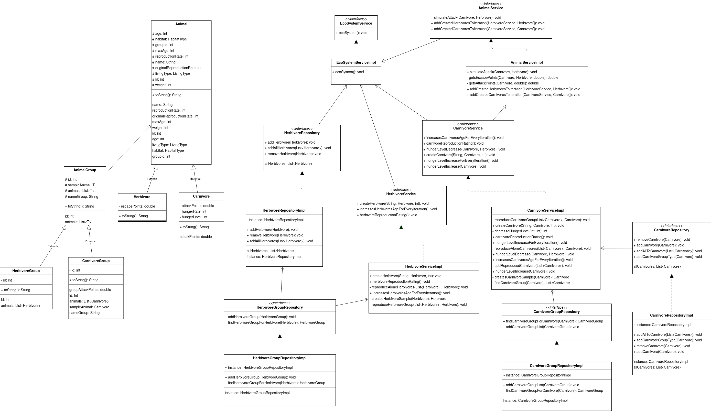

# A living ecosystem

This is a simulator that describes the behavior of animal species in an ecosystem. The program should simulate how the population of the species changes over time.

Description:

- One animal may inhabit multiple biomes.
- The EcoSystem consists of two types of animals - Carnivore and Herbivore
- Each animal is having have age, max age, weight and habitat.
- Each animal also has a reproduction rate - number of iterations after which a new representative of the species is born.
- Herbivores have escape points which show the escape-from-predator ability of the animals.
- Predators have attack-points which show the predator skills when attacking.
- During attack the chance for success of the attack is calculated with the formula: (attack points / (attack points + escape points)) * 100 %.
- The success of the attacks depends on the current age of the carnivore/herbivore.
- The attack and escape points are scaled with coefficients based on the animals’ age: 1 - currentAge / maxAge.
- Herbivores can be grouped in herds or live alone.
- Carnivores can attack in groups or separately. When they attack separately they have 50% less chance of success.
- The animal's age is preserved as a number of iterations.
- Each carnivore should have a hunger level (between 0% and 100%) and a percentage change for each iteration (for example 20%). Which shows how much “hungry” a predator becomes after each iteration.
- If the predator cannot catch a prey before it’s hunger level reaches 100% it dies.
- When a predator catches a prey then it’s hunger level decreases with the result from this formula: (herbivore weight / carnivore weight) * 100. If a group attack was organised, the prey’s weight is distributed equally between the participants. However, the carnivore that performed the attack receives two “portions”.
- On each iteration carnivores attack herbivores by randomly choosing the target.

